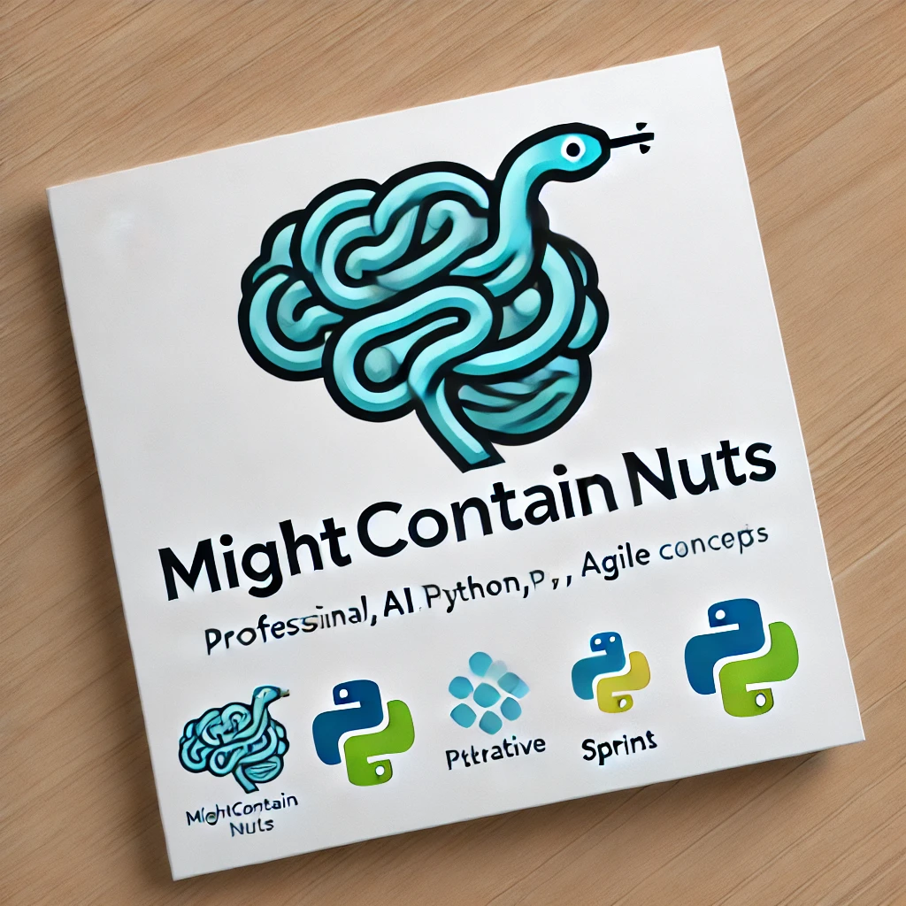

# mightcontainnuts.gitlab.io

# Dean Didion | Generative AI Engineer & Agile Leader

### 🚀 Profile Summary
Hi, I'm Dean! I'm an experienced servant leader with a passion for **Generative AI**. My expertise spans from AI-driven solutions in product development to cutting-edge research in **Generative Models** like GANs, transformers, and creative AI. I aim to bring AI closer to human creativity, applying deep learning to generate content, art, and innovative solutions.

## 🌟 Key Skills
- **Generative AI**: GANs, VAEs, Transformers (GPT, BERT), Text-to-Image Generation
- **Machine Learning**: Deep Learning, Reinforcement Learning, Supervised & Unsupervised Learning
- **Natural Language Processing (NLP)**: Text Generation, Text Summarization, Sentiment Analysis
- **Creative AI**: AI-Generated Art, Music, and Content
- **AI Tools & Frameworks**: TensorFlow, PyTorch, Keras, Hugging Face, OpenAI GPT

## 🚀 Personal Generative AI Projects
- **[Thrive Well](https://github.com/MightContainNuts/thrive_well)**: n AI-powered Flask application designed to support health, wellness, and recovery. This server integrates generative AI models to offer personalized recommendations, track progress, and optimize well-being routines. Ideal for individuals looking to enhance their physical and mental health through data-driven insights.
- **[Wanderwise](https://github.com/MightContainNuts/wanderwise)**: AI supported travel itinery creator for upcoming trips

### 🎓 Education & Certifications
- **B.Sc.(Mech)**
- **ISO 9001 Auditor**
- **Six Sigma Black Belt**
- **Agile Coach**
- **IBM AI Developer Profesional**
- **IBM DevOps Professional**
  

## 🛠 Tech Stack
- **Languages**: Python, R, JavaScript
- **Generative AI Frameworks**: TensorFlow, PyTorch, GANs, VAEs, GPT (Generative Pretrained Transformers)
- **NLP**: Hugging Face, BERT, GPT-3, Text Generation, Summarization
- **Tools**: Numpy, Pandas, Jupyter, Docker, GitHub Actions
- **Cloud**: AWS, GCP, OpenAI API, IBM Watson AI

### 📝 latests hashnode posts

You can check out all my posts on my hashnode 
[blog](https://surestride.hashnode.dev/?source=top_nav_blog_home)

<!-- BEGIN HASHNODE ARTICLES -->
1. [Automating README Updates with Hashnode Articles Using GitHub Actions](https://surestride.hashnode.dev/automating-readme-updates-with-hashnode-articles-using-github-actions)
2. [Why Python Decorators Are Essential for Clean and Readable Code](https://surestride.hashnode.dev/why-python-decorators-are-essential-for-clean-and-readable-code)
3. [Why you should user Gherkin in your user stories...](https://surestride.hashnode.dev/why-you-should-user-gherkin-in-your-user-stories)
<!-- END HASHNODE ARTICLES -->
