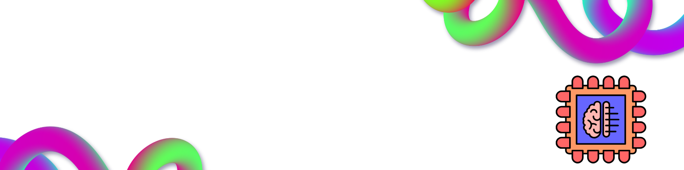

# containerising.gitlab.io

# Dean Didion | IT Manager, Generative AI Engineer & Agile Leader
Location: [Geiseltalsee, Germany](https://maps.app.goo.gl/61NqPRHPHN3MeHNV6)  
LinkedIn: [Dean Didion](https://www.linkedin.com/in/deandidion/)

### 🚀 Profile Summary

<table style="border-collapse: collapse; width: 100%;">
  <tr>
    <td style="vertical-align: top; padding-right: 20px; padding-bottom: 10px;">
      Hi, I'm Dean! I'm an experienced servant leader with a passion for **Generative AI**.  
      My expertise spans AI-driven solutions in product development and cutting-edge research  
      in **Generative Models** like GANs, transformers, and creative AI.  
      I aim to bring AI closer to human creativity, applying deep learning  
      to generate content, art, and innovative solutions.  
      Check out my CV 👉
    </td>
    <td style="vertical-align: top; text-align: center; padding-bottom: 10px;">  
       
      
    </td>
  </tr>
</table>

## 🌟 Key Skills
- **Generative AI**: GANs, VAEs, Transformers (GPT, BERT)
- **Machine Learning**: Deep Learning, Reinforcement Learning, Supervised & Unsupervised Learning
- **Natural Language Processing (NLP)**: Text Generation, Text Summarization, Sentiment Analysis
- **Creative AI**: Chatbots, Gen AI spoorted apps
- **AI Tools & Frameworks**: TensorFlow, PyTorch, Keras, Hugging Face, OpenAI GPT, LangChain, LangGraph

## 🚀 Personal Generative AI Projects
- **[Thrive Well](https://github.com/MightContainNuts/thrive_well)** :  

An AI-powered Flask application designed to support health, wellness, and recovery. This server integrates generative AI models to offer personalized recommendations, track progress, and optimize well-being routines. Ideal for individuals looking to enhance their physical and mental health through data-driven insights.

- **[Wanderwise](https://github.com/MightContainNuts/wanderwise)**: 

AI supported travel itinery creator for upcoming trips

- **[The Companion](https://github.com/yhupe/the-companion)**: 
  
A non profitable WhatsApp based Chatbot. Originally part of a Hackathon (which we won). It uses OpenAI, diverse APIs to offer services to the elderly.   

## 🎓 Education & Certifications

<table style="border-collapse: collapse; width: 100%;">
  <tr>
    <!-- Left Column: Academic & Professional Certifications -->
    <td style="vertical-align: top; padding-right: 20px; width: 50%;">
      <ul>            
          <li><strong>B.Sc. (Mech)</strong>  </li>
          <li><strong>ISO 9001 Auditor</strong>  </li>
          <li><strong>Six Sigma Black Belt</strong>  </li>
          <li><strong>Agile Coach</strong>  </li>
          <li><strong>AI Developer Professional</strong>  </li>
          <li><strong>AI DevOps Professional</strong>  </li>
          <li><strong>AI Data Science Specialist</strong>  </li>
          <li><strong>Generative AI Engineering with LLMs</strong>  </li>
      </ul>
    </td>
    <!-- Right Column: IBM Professional Certifications with Links -->
    <td style="vertical-align: top; text-align: center; width: 50%;">
      
      
      
      
    </td>
  </tr>

  <!-- Bottom Row: Credly Badges -->
  <tr>
    <td colspan="2" style="text-align: center; padding-top: 20px;">
      <!-- Example Badges (Replace with actual Credly badge links) -->
      
      
      
      
      
        <a href="https://www.credly.com/badges/0d7a7e30-7a79-45bf-a527-69fbd353c306">
            
      
      
      
       
      
       
      
      
      
      
    </td>
  </tr>
</table>

## 🛠 Tech Stack

- **Languages**:
  
  
  
  
  

- ***Generative AI Frameworks***:
  
  
  
  
  
  
  
  

- ***NLP***:
  
  
  
  

- ***Tools***:
  
  
  
  
  
  

- ***Cloud***:
  
  
  
  
  

## 📝 latests hashnode posts

You can check out all my posts on my hashnode 
[blog](https://surestride.hashnode.dev/?source=top_nav_blog_home)

<!-- BEGIN HASHNODE ARTICLES -->
1. [PR Ettiquette : my pet likes, hates](https://surestride.hashnode.dev/pr-ettiquette-my-pet-likes-hates)
2. [How to Install Poetry on PyCharm and Use It as an Interpreter](https://surestride.hashnode.dev/how-to-install-poetry-on-pycharm-and-use-it-as-an-interpreter)
3. [Understanding the Python @property Decorator:  (Getters, Setters, and why you should be using them)](https://surestride.hashnode.dev/understanding-the-python-property-decorator-getters-setters-and-why-you-should-be-using-them)
<!-- END HASHNODE ARTICLES -->

## Stats

